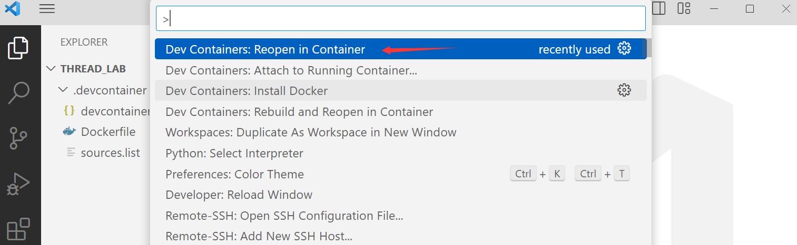

# User Level Thread
## 截止: 2023.10.21 23:59
助教 qiuqichen@bupt.edu.cn
# 背景
为了方便讲解，以下都以Linux x86-64使用的标准进行讲解。Windows中采用的Calling Convention和这里略有不同，因此建议使用docker环境进行试验和学习。对于Arm64环境的同学，建议是换到一台有x86-64环境的PC。

## x86-64 寄存器
x64提供了以下通用寄存器。每个寄存器都可以访问其32-,16,8-bit的寄存器。

其中部分寄存器还具有特殊的含义，例如%rsp通常作为栈指针，%rbp作为栈帧基指针,%rax作为返回值等等。

除了上面的寄存器外，还有一些特殊寄存器。例如%rip，%cs,%gs等等。这些寄存器主要和程序控制流相关，一般有特殊的指令进行修改。例如%rip寄存器是程序计数寄存器，用于指示当前执行到第几条指令。使用jmp指令可以跳转到某个地址，也就是改变%rip寄存器的值。

## Linux x64 stack frame

```c
long myfunc(long a, long b, long c, long d,
            long e, long f, long g, long h)
{
    long xx = a * b * c * d * e * f * g * h;
    long yy = a + b + c + d + e + f + g + h;
    long zz = utilfunc(xx, yy, xx % yy);
    return zz + 20;
}
```
上图是一个C函数的栈帧。

栈帧是计算机内存中用于支持程序执行中的函数或过程调用的数据结构。当一个函数或过程被调用时，一个新的栈帧就会被创建并添加到程序的调用栈的顶部。

每一个栈帧常常包含以下几个部分：
* 函数参数：当一个函数被调用时，它的参数（如有的话）会在内存中被保存进新的栈帧。
* 返回地址：栈帧也保留函数调用完成后的返回地址。这样，在函数执行完后，程序就能知道要跳回哪里去继续执行。

* 局部变量：函数中定义的任何局部变量都存储在其栈帧中。

* 帧指针：这是一个指向当前栈帧的指针，可用于快速访问栈帧中的数据。

栈是由**高地址向低地址**增长的。每次压栈，rsp = rsp - 8。

在调用另一个函数时，首先编译器会把参数传入寄存器，当参数多于6个时，多余的参数会被放入栈中，例如上图的h，g。 

然后，执行call指令，跳转到函数，并在栈中保存函数地址。当进入新函数时，编译器会把%rbp压入栈中，然后把新的%rbp指向栈顶。

最后，编译器会为临时变量xx,yy,zz预留空间。

> 栈顶通常还会有一块red zone，但在linux中被忽略[[4]](#参考).。red zone通常用来作为函数临时数据的存放位置。[[5]](#参考)
## Calling Convention

* 用户级应用程序依次用以下寄存器来传递参数：%rdi、%rsi、%rdx、%rcx、%r8 和 %r9（指的是参数为指针或者8字节以下的整数类型的一般情况）。 
> 在Windows x64中，%rdx,%rcx分别是第一个和第二参数的寄存器
* %rax通常作为返回值寄存器
* caller-saved表示调用者保存，callee-saved表示被调者保存。%rbx,%rsp,%rbp,%12-%15的寄存器均需要被调用者提前保存。调用结束后再恢复这些寄存器（如果有用到）。此外，还有一些上图未提及的寄存器需要保存，例如%rip,%xmm0还有一些标志寄存器等等。
* 因此，理论上来说，在一个单线程的只执行整数运算的简单程序中，我们只需要保存上述的寄存器即可保存上下文。

## 汇编代码
下面简单介绍一下后面所用到的汇编代码。

* `pop A`： 把原先rsp指针指的内存的值放到A中，然后rsp=rsp+8
* `movq A B` : 
    * 其中(A) 表示把A当成指针，对A指向地址的内存
    * NUMBER(A),表示(A+NUMBER)，也就是A+NUMBER处的内存
* `push A`: 把A的值放到原来rsp处，然后rsp=rsp-8
* `ret`: pop A,jmp A。pop出一个地址，然后跳转到那个地址去执行。在函数调用时会有返回地址，调用结束后会回到那个返回地址


# 实验环境搭建
实验环境要求下面几个部分：
1. x86-64 linux环境
2. gcc,make

因此如果你有linux环境，例如wsl或者云服务器，可以直接在上面进行实验。

为了方便大家进行实验，我们搭建了一个devcontainer。只有windows的同学仅需要安装docker和vscode devcontainer插件即可。

PS: github上的code space也可以用。但我没有测试过。

## 使用devcontainer
### 安装vscode
[Windows](https://vscode.cdn.azure.cn/stable/1ad8d514439d5077d2b0b7ee64d2ce82a9308e5a/VSCodeUserSetup-x64-1.74.1.exe) 

[Mac OS](https://vscode.cdn.azure.cn/stable/e8a3071ea4344d9d48ef8a4df2c097372b0c5161/VSCode-darwin-universal.zip)
### 安装dev container插件
 在vscode插件市场安装devcontainer:


> 如果你在Windows下使用dev container的插件，并且安装了wsl，可能需要手动将插件版本等级降级到v0.266.1
> 
> [参考](https://github.com/microsoft/vscode-remote-release/issues/8172)
> 
> 选择较低版本后，reload window即可。

### 安装Docker
* 可以参考这个链接: [安装docker](https://github.com/rust-real-time-os/os_lab/tree/lab2#docker%E5%AE%89%E8%A3%85%E5%8F%8A%E6%8B%89%E5%8F%96%E4%BB%A3%E7%A0%81)
* 也可以在vscode里按ctrl+shift+P,输入`install`
#### troubleshooting


如果安装遇到上面问题，可能需要安装一下wsl2。[一个参考](https://blog.csdn.net/qq_43636384/article/details/128453416)

### git clone 本项目
#### git 安装
[链接](https://registry.npmmirror.com/-/binary/git-for-windows/v2.42.0.windows.2/Git-2.42.0.2-64-bit.exe)

#### clone

* 也可以下载，最好是clone，这样有更新就可以拉取到了。
```bash
git clone https://github.com/rust-real-time-os/easy_lab.git

# git clone https://gitee.com/ruiqurm/easy_lab.git
```
### 使用dev container启动
打开项目文件夹


打开的时候`.devontainer`要在第一层文件夹：


按ctrl+shift+P或者F1，输入reopen.. 选择下面这个选项即可使用dev container


# 用户态线程
下面你需要实现一个简单的有栈协程。

有栈协程可以在执行期间保存完整的函数调用栈状态，这意味着当协程被暂停时，它可以在稍后恢复执行，继续执行被中断的地方。
> 与有栈对应的是无栈协程。无栈协程并不是不需要栈，而是用的就是默认的栈。它的局部变量保存在堆分配内存上，因此每次切换实际上只需要管理控制流。对于无栈协程，它每次切换接近于函数调用。
> 我们这里实现的有栈协程和内核中线程的实现更为相近。感兴趣的话可以阅读其他教学内核中关于线程切换部分。

我们已经提供了一个简单的代码框架在：`uthread.h`和`uthread.c`。

具体来说，你需要实现这样的用户态线程框架：

* 用户程序调用`uthread_create`创建一个协程，放入调度队列中。
* 创建完全部的协程后，主线程调用`schedule()`阻塞进入调度程序，开始执行各个协程。调度采用FIFO(先进先出)的顺序
* 线程开始执行的时候，首先跳转到函数`_uthread_entry`,然后才进入对应的函数
* 当协程中的函数调用`uthread_yield`时，控制权转让给调度器
* 当调度器执行`uthread_resume`时，会重新在中断的地方开始执行
* 当调度器发现函数执行结束时，会调用`thread_destory`销毁结构体。


## 你的任务
修改代码，通过测试recursion.c，simple.c和pingpong.c

执行
```
make 
```
即可编译uthread.c和所有测试。

使用
```
make tests
```
运行测试。


你可能主要需要修改下面的函数：
* 初始化系统：`init_uthreads`
* 初始化每个用户态线程：`uthread_create`
* 调度: `schedule`
* 切换线程: `uthread_yield`和 `uthread_resume`
* _uthread_entry : 函数的入口

除此以外，你可能还需要一些helper函数，例如调度时的FIFO，你可以用数组实现也可以用链表实现（建议用链表）。

你可以随意修改uthread.c/h和switch.S的其他部分。只要最终能编译并通过测试即可。

## Guideline
如果你不知道从哪里开始，你可以参考下面的建议。

1. 阅读switch.S的代码
2. 阅读`struct context`的成员变量，看如何使用该结构体与`thread_switch`交互
2. 写一个简单的demo，尝试调用`thread_switch`
4. 阅读uthread.c上面的框架，看`_uthread_entry`需要传哪些参数。

在阅读的过程中，你可能会遇到很多没学过的知识，比如你可能读不明白汇编代码的含义。这时我们建议用chatGPT之类的大模型工具来辅助快速上手学习。

例如，你可以问它这段汇编代码的含义


## TIPS
* 注意栈需要16字节对齐，下面的代码可以帮你对齐：
```
address & -16L
```
完成对齐后，还需要将栈指针向下移动一个字长（-8字节），让它8字节对齐但是不16字节对齐（这和我们的汇编部分的实现有关，后面切换线程进入新函数会压入一个%rbp，使得栈指针16字节对齐）。如果后面发现segment fault，可能是这里有问题
* 注意栈是向下增长的，因此你初始化时栈指针应该是在高地址的
* 对于线程切换，我们提供了一段汇编代码在`switch.S`中。你也可以使用ucontext.h或者自己用汇编实现一段逻辑。
* 每个线程的入口都是`_uthread_entry`，然后在内部再去调用对应的线程函数。
* 注意设置标志位，以及利用标志位检查需要运行的线程。
* `_uthread_entry`结束后，需要回到调度器，因此你需要调用thread_switch
* 你可以使用全局`current_thread`和`main_thread`来保存当前执行的主线程和用户态线程的上下文。
* 你可以使用gdb来调试bug
## Challenge 
* thread_swtich里只保存了整数寄存器的上下文。如何拓展到浮点数？
* 上面我们只实现了一个1 kthread :n uthread的模型，如何拓展成m : n的模型呢
* 上述的实现是一个非抢占的调度器，如何实现抢占的调度呢？
* 在实现抢占的基础上，如何去实现同步原语（例如，实现一个管道channel）

# 提交方式与评分
你需要提交你的代码以及一份简单的报告。

报告的内容包括：简单阐述你的实现，实验中遇到的困难，你的思考等等，报告数百字即可。

报告占比30%,实验70%

提交方式为暂时为生成一个patch，在[平台](http://10.109.246.160:8765/admin)(使用校园网访问)提交。如何生成patch,详见[提交](https://github.com/rust-real-time-os/os_lab/tree/lab1#%E6%8F%90%E4%BA%A4)。如果出现提交问题，可以参考zulip上面的[汇总](https://rros.zulipchat.com/#narrow/stream/376116-general/topic/.5B.E6.8F.90.E4.BA.A4.E9.94.99.E8.AF.AF.E8.AF.B7.E5.85.88.E7.9C.8B.E6.AD.A4.E8.B4.B4.5D)


# 参考
1. [AMD64 Architecture Programmer’s Manual, Volume 1: Application Programming.](https://www.scs.stanford.edu/05au-cs240c/lab/amd64/AMD64-1.pdf)
2. [X86-64 Architecture Guide](http://6.s081.scripts.mit.edu/sp18/x86-64-architecture-guide.html)
3. [mit 6.s081 user level thread](https://pdos.csail.mit.edu/6.S081/2020/labs/thread.html)
4. [System V Application Binary Interface](https://refspecs.linuxbase.org/elf/x86_64-abi-0.99.pdf) 
5. [Stack frame layout on x86-64](https://eli.thegreenplace.net/2011/09/06/stack-frame-layout-on-x86-64/)