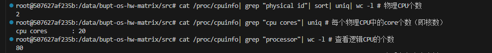
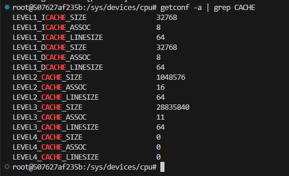

# Accelerate matrix multiplication

## 截止：2023.11.13 23:59

助教 Dujiajun@bupt.edu.cn

## 任务和评分

矩阵乘法是一个有着广泛应用的基础算法，比如神经网络的核心计算任务就是矩阵乘法，因此如何提升矩阵乘法的效率是一个值得深入思考的问题。

本次Lab中我们就来运用课上的知识来代码实现加速矩阵乘法，并且将最终的实现代码提交至评测平台，顺利通过平台上的测试。

加速的方式有很多，你提交至评测系统的代码实现仅限于提高cache命中率、多线程两个方面的加速。

此外，鼓励大家自行探索更多的加速方法（见bonus）。

### 准备环境

easy_lab2沿用在easy_lab1中搭建好的docker容器Linux环境。本次lab使用c++，需要在终端执行以下指令，安装g++：

```bash
# 安装g++
apt-get update && apt-get install g++
```

### 拉取代码

easy_lab2在本仓库的lab2分支上，gitee链接：https://gitee.com/ruiqurm/easy_lab/tree/lab2/

由于lab2分支和lab1分支之间没有共享的commit历史信息，为了避免一些冲突，直接使用以下命令拉取分支，然后就可以在easy_lab2目录下开始做lab了。

```bash
# 将lab2分支拉取到easy_lab2目录下
git clone -b lab2 https://gitee.com/ruiqurm/easy_lab.git easy_lab2
# 或者
git clone -b lab2 https://github.com/rust-real-time-os/easy_lab.git easy_lab2
```

### 提交方式

本次Lab代码的实现只在multiply.cpp文件中完成，只需要在该文件做修改即可，完成后把该文件和报告提交到评测平台，不需要生成patch。

### 评分规则

本次作业的分数分为两部分：代码（70%）和报告（30%）。

报告的内容：简单阐述你的实现，可以对比不同的参数（比如分块大小、线程个数）所带来的不同程度的性能提升，实验中遇到的困难，你的思考等等。

代码的评分分为两部分：正确性测试和加速的效果测试。

正确性的测试就是验证计算结果的正确性。为了避免一些无聊的边界条件的判断，简化实现，保证测试平台中的N、M、P都是可以被4整除的。

加速效果的评判方式是计算运算的时间是否可以接受。一个衡量处理器的浮点计算指标是Flops，即每秒的浮点数运算次数，本质上也是在判断运算时间的长短，计算方式非常简单，可以通过阅读代码了解。平台上我们测试的样例和接受的条件如下表，如果你的矩阵乘法不满足可接受的条件，那么就会被判定为**Time limit exceed**。通过测试样例即得到相应的分数。

|矩阵大小|运行时间上限(us微秒)|GFlops下限|测试样例分数|
|-----|-----|-----|-----|
|(512\*512) x (512\*512)|26843|10|10|
|(1024\*1024) x (1024\*1024)|89478|24|12|
|(2048\*2048) x (2048\*2048)|505290|34|14|
|(2560\*2560) x (2560\*2560)|838860|40|16|
|(3072\*3072) x (3072\*3072)|1317774|44|18|

> 由于大家本地机器和评测平台的服务器的配置可能不同，所以在tips部分中给出了服务器的CPU、cache的相关信息，可以根据这些信息作为参数设定的参考。

## 基础知识讲解

这里仅简单介绍一下，给大家提供一个基本的方向，请重点思考提高缓存命中率、多线程这两种方法的结合，也可以通过阅读后面的学习资料得到更多的加速思路。

### cache

CPU的计算速度比主存的读写速度快近百倍，cache为CPU提供了高速的存储访问，低的缓存命中率会让算法的耗时大大增加，因此提高cache的命中率是一个非常有效的方法。

计算机在访问数组的时候并不是逐个从内存中访问的，而是以cacheline为单位去访问，这就是利用了访存的空间局部性。由于CPU的cache是有限的，当cache满了之后如果还要有新的cacheline进来，就需要把旧的cacheline驱逐出去，所以如果连续访问同一个cacheline中的数据就会比零散的访问不在同一个cacheline的数据要快很多。所以基于上面的性质，我们可以考虑比较简单的加速思路：

* 调整计算的顺序，这就是常常用来举例的ijk和ikj的顺序调整
* 把矩阵进行分块，使得小块内的数据都在cache中
* 进行分块后，由于块内行与行之间、列与列之间仍然是不连续的，进行数据重排

### 多线程

并行化一般能够带来和CPU核心数量成比例的加速，把任务拆分成多个子任务进行并行化计算会给性能带来很高的提升。

需要注意并行化的多个线程之间的公共数据的读写应该是线程安全的，不然会导致计算结果不正确。

## Lab代码介绍

Lab相关的代码在./src/目录下。

main.cpp是测试的主要逻辑。矩阵的大小通过宏定义的方式定义在main.h中，使用g++进行编译的时候可以通过-D参数进一步的更改宏定义中的值，从而改变矩阵的形状。matrix.h和matrix.cpp中给出了一个最基本的矩阵乘法实现，用来测试你的计算结果是否正确（判断正确性的数据范围较小）。

你所实现的代码应该全部都在multiply.cpp文件中完成。

### 实现matrix_multiplication函数

multiply.cpp文件中最初只包含了matrix_multiplication这一个函数，你可以在该文件中`#include`头文件或者定义其他数据结构、函数等，测试时我们只会调用你实现的matrix_multiplication进行测试。

### 本地测试方法

完成代码后，可以通过下面的指令进行编译，注意如果有使用头文件thread或者pthread.h，需要添加-pthread（如果有使用SSE3指令集，需要添加-mfma，见bonus）。

```bash
# 测试正确性
# 会打印出计算结果是否正确
g++ main.cpp matrix.cpp multiply.cpp -std=c++1z -pthread -mfma -o main -D JUDGE_RIGHT -D N=280 -D M=8 -D P=124
```

```bash
# 测试时间
# 会打印出运算时间和GFlops
g++ main.cpp matrix.cpp multiply.cpp -std=c++1z -pthread -mfma -o main -D N=1024 -D M=1024 -D P=1024
```

编译完毕，运行./main文件，查看运行的log信息。

## bonus

思考与加分项：

1. 在Intel的SSE3指令集中，包含了一个神奇的指令：可以在一个时钟周期内完成两次浮点数的乘法和两次浮点数的加法。在提升了cache命中率和采用多线程计算后，这个指令可以很好的帮助我们进一步地提升矩阵乘法的性能，并且使用非常简单，可以参考[1]、[2]、[3]。请给出使用SSE3指令集前后的性能对比和代码。

2. 为什么有时候多线程性能反而不如单线程？在什么情况下会导致这样的情况？

3. 矩阵乘法是否会出现频繁的内存缺页？如何解决这样的问题？

4. 尝试使用GPU进行矩阵运算，CPU和GPU运算各有什么特点？为什么GPU矩阵运算远远快于CPU？

这部分内容有精力的同学可以将你的答案和代码写在提交的报告里。

## tips

服务器上的矩阵是行主序存储（row-major）方式，CPU、缓存信息如下：





解释一下第二章图中的cache信息：

1. 所有数据的单位均为Byte
2. 一级缓存分为指令缓存和数据缓存两种，分别使用ICACHE、DCACHE表示
3. SIZE指该级缓存的总大小
4. LINESIZE表示该级缓存的cacheline大小，也就是该级缓存向低一级缓存访问时一次性抓取的数据量大小
5. ASSOC指该级缓存组相联的组数

## 参考

[1] wiki：https://github.com/flame/how-to-optimize-gemm/wiki

[2] SSE指令集学习笔记：https://packagewjx.github.io/2018/11/12/sse-note/

[3] Intel指令集：https://www.intel.com/content/www/us/en/docs/intrinsics-guide/index.html#ig_expand=4034,4074,4009

[4] 学习资料：http://giantpandacv.com/project/%E9%83%A8%E7%BD%B2%E4%BC%98%E5%8C%96/%E6%B7%B1%E5%BA%A6%E5%AD%A6%E4%B9%A0%E7%BC%96%E8%AF%91%E5%99%A8/%E3%80%90TVM%20%E4%B8%89%E4%BB%A3%E4%BC%98%E5%8C%96%E5%B7%A1%E7%A4%BC%E3%80%91%E5%9C%A8X86%E4%B8%8A%E5%B0%86%E6%99%AE%E9%80%9A%E7%9A%84%E7%9F%A9%E9%98%B5%E4%B9%98%E6%B3%95%E7%AE%97%E5%AD%90%E6%8F%90%E9%80%9F90%E5%80%8D/
